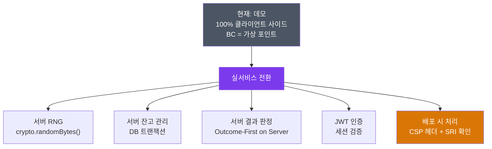

# 🔐 BC Slot — 보안 검토 보고서 (Security Review Report)

> **대상**: [index.html](file:///Users/vertigo_teddy/Documents/ai_publishing/bc_slot/dist/index.html), [app.js](file:///Users/vertigo_teddy/Documents/ai_publishing/bc_slot/dist/js/app.js)
> **검토 일시**: 2026-06-10 (v2.1 기준)
> **현재 상태**: 로컬 클라이언트 사이드 데모 (BC = 가상 재화, 실제 거래 없음)
> **대상 환경**: 향후 백엔드 연동 실서비스 전환 시를 기준으로 작성

---

## 📌 아키텍처 전제

현재 코드는 **100% 클라이언트 사이드 JavaScript** 구조입니다. 이는 BC가 실제 재화가 아닌 가상 포인트인 데모 단계에서는 문제가 없습니다. 그러나 실서비스 전환 시 백엔드 도입이 필수이며, 그 시점에 대부분의 취약점은 **구조적으로 해소**됩니다.

```
현재 (데모)         →    실서비스 전환 후
─────────────────────────────────────────────
100% 클라이언트      →    클라이언트 = 애니메이션 재생기
클라이언트가 RNG     →    서버가 RNG + 결과 판정
클라이언트가 잔고    →    서버 DB가 잔고 관리
Boolean 로그인       →    JWT / 세션 인증
```

---

## ✅ 백엔드 도입으로 자동 해소되는 항목 (9건)

> [!NOTE]
> 아래 항목들은 **실서비스 전환 시 서버 사이드 처리로 구조적으로 해결**됩니다.
> 현재 데모 단계에서는 BC가 실제 재화가 아니므로 실질적 피해가 없습니다.

| # | 현재 취약점 | 실서비스 해소 방법 |
|---|------------|-------------------|
| 1 | 잔고(`balance`) DevTools로 직접 수정 가능 | 서버 DB에서 잔고 관리 → 클라이언트 값은 표시용 |
| 2 | 테스트 모드 강제 전환 (`vm.gameMode = 'test'`) | 모드를 서버에서 제어 → 클라이언트 변수 의미 없음 |
| 3 | `pickOutcome()`, `calculateWin()` 등 결과 함수 덮어쓰기 | 서버가 결과 판정 후 내려줌 → 클라이언트 함수 무의미 |
| 4 | `doSpin(true)`로 무료 스핀 무한 호출 | 서버에서 free spin 횟수 검증 |
| 5 | `vm.isLoggedIn = true` 인증 우회 | JWT/세션 기반 인증 → boolean 토글 불가 |
| 6 | 베팅금액 음수/초과 조작 (`vm.betAmount = -10000`) | 서버에서 bet 범위 검증 필수 |
| 7 | `OUTCOME_TABLE` 가중치 직접 변조 | 가중치 테이블을 서버에서 관리 |
| 8 | `Math.random()` PRNG 예측 가능 | 서버 사이드 CSPRNG (`crypto.randomBytes()`) 사용 |
| 9 | 히스토리 위조 (가짜 당첨 스크린샷) | 서버 DB에 히스토리 저장 + HMAC 서명 |

---

## ⚠️ 실서비스 전환 후에도 별도로 처리해야 하는 항목 (4건)

> [!IMPORTANT]
> 아래 항목들은 백엔드 구조와 무관하게 **프론트엔드 배포 단계에서 직접 처리**해야 합니다.

---

### 1. CDN 공급망 공격 (Supply Chain Attack)

| 항목 | 상세 |
|------|------|
| **현황** | Vue.js, canvas-confetti를 jsdelivr CDN에서 로드 |
| **위험** | CDN이 침해될 경우 악성 스크립트가 사용자 브라우저에서 실행됨 |
| **백엔드와 무관한 이유** | 서버가 정상이어도 프론트엔드 CDN 스크립트가 변조되면 클라이언트 세션 토큰 탈취 가능 |
| **난이도** | ⭐⭐⭐⭐⭐ (CDN 자체를 침해해야 하나, 영향은 치명적) |

**대응** — 배포 시 SRI(Subresource Integrity) hash 추가:

```html
<!-- 현재 코드에 이미 SRI 적용되어 있음 ✅ -->
<script src="https://cdn.jsdelivr.net/npm/vue@2.7.14/dist/vue.min.js"
  integrity="sha384-05dHfbm/..."
  crossorigin="anonymous"></script>
```

> [!TIP]
> 현재 index.html에 이미 Vue에 대한 SRI hash가 적용되어 있습니다. canvas-confetti에도 동일하게 확인 후 유지하세요.

---

### 2. Content Security Policy (CSP) 부재

| 항목 | 상세 |
|------|------|
| **현황** | HTTP 응답 헤더에 `Content-Security-Policy` 없음 |
| **위험** | XSS 취약점 발생 시 공격 코드 실행 제한 없음. 백엔드 JWT 세션 토큰 탈취 가능 |
| **백엔드와 무관한 이유** | XSS로 서버 세션 토큰이 탈취되면 백엔드 인증도 우회됨 |

**대응** — 웹서버(nginx / Apache / CDN) 설정에서 CSP 헤더 추가:

```nginx
# nginx 예시
add_header Content-Security-Policy "
  default-src 'self';
  script-src 'self' https://cdn.jsdelivr.net;
  style-src 'self' 'unsafe-inline';
  img-src 'self' data:;
  media-src 'self';
  connect-src 'self' https://your-api-domain.com;
";
```

---

### 3. UI 신뢰도 조작 (타이머 / 당첨자 토스트)

| 항목 | 상세 |
|------|------|
| **현황** | `vm.timerD`, `WINNERS[]` 등 UI 데이터를 DevTools로 조작 가능 |
| **실제 위험** | 금전적 피해는 없으나, 조작된 화면을 스크린샷으로 캡처해 사기성 홍보에 악용 가능 |
| **백엔드와 무관한 이유** | 이벤트 타이머, 당첨자 목록이 서버에서 내려와도 클라이언트에서 변조 가능 |

**대응** — 실서비스에서는 당첨자 데이터를 서버 API에서 실시간으로 가져오고, 타이머 종료 시점도 서버 시간 기준으로 검증.

---

### 4. 프로토타입 오염 / 전역 스코프 (LOW)

| 항목 | 상세 |
|------|------|
| **현황** | `SYMBOLS`, `OUTCOME_TABLE` 등이 전역 `window` 스코프에 노출 |
| **실서비스 영향** | 서버 사이드 결과 판정 후에는 이 데이터들이 UI 참조용으로만 쓰이므로 위험도 낮아짐 |
| **완화 방법** | IIFE 패턴 또는 ES Module로 전역 노출 최소화 (번들러 사용 시 자동 해결) |

---

## 🗺️ 실서비스 전환 로드맵



| 우선순위 | 항목 | 시점 | 효과 |
|:---:|------|:---:|------|
| 1 | **서버 사이드 게임 로직 이전** (RNG + 결과 판정) | 실서비스 전환 시 | 9건 자동 해소 |
| 2 | **서버 인증 시스템** (JWT / 세션) | 실서비스 전환 시 | 인증 우회 차단 |
| 3 | **CSP 헤더 적용** | 배포(웹서버 설정) 시 | XSS → 세션 탈취 방지 |
| 4 | **SRI hash 확인** | 배포 시 (현재 Vue는 적용됨) | CDN 공급망 공격 방어 |
| 5 | **당첨자/타이머 서버 API화** | 실서비스 전환 시 | UI 신뢰도 조작 방지 |

---

> [!NOTE]
> **현재 데모 단계 결론**: BC가 실제 재화가 아니고 로컬 환경에서 동작하는 한, 위의 취약점들은 실질적 피해를 유발하지 않습니다. 실서비스 전환(백엔드 연동) 시점에 서버 사이드 아키텍처를 채택하면 대부분 구조적으로 해소되며, CSP·SRI는 배포 단계에서 웹서버 설정으로 처리하면 됩니다.
