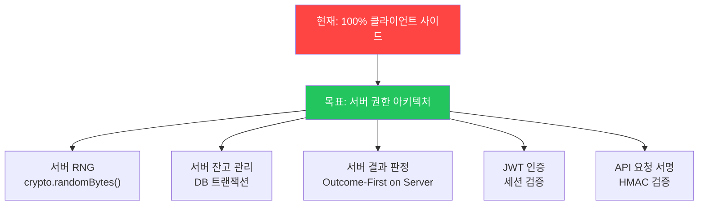

# 🔓 BC Slot — 보안 취약점 보고서 (Penetration Test Report)

> **대상**: [index.html](file:///Users/vertigo_teddy/Documents/ai_publishing/bc_slot/dist/index.html), [app.js](file:///Users/vertigo_teddy/Documents/ai_publishing/bc_slot/dist/js/app.js)
> **검토 일시**: 2026-06-09
> **검토 관점**: 공격자(해커) 시점

---

## 요약: 발견된 취약점 18건

| 등급 | 건수 | 설명 |
|:---:|:---:|------|
| 💀 **CRITICAL** | 5건 | 게임 결과/잔고 직접 조작, 인증 우회 |
| 🔴 **HIGH** | 5건 | RNG 예측, 베팅값 조작, 공급망 공격 |
| 🟠 **MEDIUM** | 4건 | CSP 부재, 히스토리 위조, 타이머 조작 |
| 🟡 **LOW** | 4건 | 인라인 이벤트핸들러, 프로토타입 오염 등 |

> [!CAUTION]
> **근본 원인**: 모든 게임 로직(RNG, 잔고 관리, 베팅, 당첨 판정)이 **클라이언트 사이드 JavaScript**에서 실행됩니다. 브라우저 DevTools만 열면 전체 게임 상태를 읽고 쓸 수 있습니다.

---

## 💀 CRITICAL — 즉시 악용 가능

### CVE-BC-001: Vue 인스턴스 직접 조작으로 잔고 무한 충전

```js
// 브라우저 콘솔에 한 줄만 입력하면 됨
const vm = document.querySelector("#app").__vue__
vm.balance = 999999999
vm.sessionBudget = 999999999
```

| 항목 | 상세 |
|------|------|
| **영향** | 잔고(balance)와 세션 예산(sessionBudget)을 임의 금액으로 설정 가능 |
| **난이도** | ⭐ (초보자도 가능) |
| **대응** | 서버 사이드에서 잔고 관리 필수. 클라이언트 값은 화면 표시용으로만 사용 |

---

### CVE-BC-002: 테스트 모드 강제 전환

```js
vm.gameMode = "test"
```

| 항목 | 상세 |
|------|------|
| **영향** | TEST_OUTCOME_TABLE 적용 → MEGA JACKPOT 확률 **0.009% → 3.57%** (397배 증가) |
| **난이도** | ⭐ |
| **추가 위험** | UI의 MODE 토글도 별도 보호 없이 노출되어 있음 |
| **대응** | 테스트 모드를 프로덕션 빌드에서 완전 제거. 또는 서버에서 모드를 제어 |

---

### CVE-BC-003: 게임 결과 결정 함수 덮어쓰기

```js
// 방법 1: 매 스핀마다 MEGA JACKPOT 강제
pickOutcome = () => ({ type: "3match", id: "crown", weight: 9 })

// 방법 2: 당첨금 판정 함수 변조
calculateWin = (r, b) => ({ winAmount: b * 1000, multiplier: 1000, tier: "mega" })
```

| 항목 | 상세 |
|------|------|
| **영향** | 게임의 핵심 로직인 `pickOutcome()`, `calculateWin()`, `buildReelsFromOutcome()`이 전역 스코프에 노출. 공격자가 자유롭게 덮어쓸 수 있음 |
| **난이도** | ⭐⭐ |
| **대응** | 결과 판정은 반드시 서버에서 수행. 클라이언트는 결과를 수신하여 애니메이션만 재생 |

---

### CVE-BC-004: 무료 스핀 무한 호출

```js
vm._spinLock = false
vm.doSpin(true)  // isFree = true → 예산 차감 없이 스핀

// 자동화 공격
setInterval(() => { vm._spinLock = false; vm.doSpin(true) }, 4000)
```

| 항목 | 상세 |
|------|------|
| **영향** | `doSpin(true)`의 `isFree` 파라미터로 예산 차감을 완전히 우회. spinLock도 강제 해제 가능 |
| **난이도** | ⭐ |
| **대응** | Free spin 사용 여부를 서버에서 검증. 클라이언트의 isFree 파라미터 신뢰 금지 |

---

### CVE-BC-005: 인증 우회 (Authentication Bypass)

```js
vm.isLoggedIn = true
vm.selectedChar = 'teddy'
```

| 항목 | 상세 |
|------|------|
| **영향** | 비밀번호, 토큰 없이 로그인 상태 전환 가능. `toggleLogin()`이 단순히 boolean 토글 |
| **난이도** | ⭐ |
| **대응** | 서버 인증 시스템(JWT/세션) 도입. 클라이언트 isLoggedIn은 서버 응답 기반으로만 설정 |

---

## 🔴 HIGH — 심각한 조작 가능

### CVE-BC-006: PRNG 예측 가능 (Math.random)

| 항목 | 상세 |
|------|------|
| **위치** | [pickOutcome()](file:///Users/vertigo_teddy/Documents/ai_publishing/bc_slot/dist/js/app.js#L161-L167) |
| **영향** | `Math.random()`은 V8의 Xorshift128+ 알고리즘 사용. 약 5개의 연속 출력값으로 내부 상태 복구 가능 → **다음 스핀 결과 예측** |
| **난이도** | ⭐⭐⭐⭐ (전문 지식 필요) |
| **도구** | z3 SMT solver, 공개된 V8 PRNG 역추적 스크립트 존재 |
| **대응** | 서버 사이드에서 `crypto.getRandomValues()` 또는 HSM 기반 TRNG 사용 |

---

### CVE-BC-007: 베팅금액 음수/초과 조작

```js
// 음수 베팅: MISS해도 예산 증가
vm.betAmount = -10000
// sessionBudget -= (-10000) → sessionBudget += 10000

// 초과 베팅: MAX_BET(1000) 우회
vm.betAmount = 999999
// MEGA 당첨 시: 999,999 × 1000 = 999,999,000 BC
```

| 항목 | 상세 |
|------|------|
| **영향** | `doSpin()`에서 `betAmount` 유효성 검증 없음. `setBetFromInput()`의 클램핑은 UI 입력 시에만 작동하고 직접 `vm.betAmount` 설정 시 우회됨 |
| **난이도** | ⭐ |
| **대응** | `doSpin()` 진입 시 `bet` 값의 범위 검증 추가. 서버에서 베팅 금액 검증 필수 |

---

### CVE-BC-008: OUTCOME_TABLE 직접 변조

```js
// MEGA JACKPOT 확률을 99.99%로
OUTCOME_TABLE[0].weight = 99990
OUTCOME_TABLE.slice(1).forEach(o => o.weight = 0)
// OUTCOME_TOTAL도 recalc 필요 없음 - pickOutcome이 실시간 계산하지 않음
```

| 항목 | 상세 |
|------|------|
| **영향** | `OUTCOME_TABLE`과 `OUTCOME_TOTAL`이 전역 `const`이지만 배열/객체 내용은 mutable. `Object.freeze()` 미적용 |
| **난이도** | ⭐⭐ |
| **참고** | `OUTCOME_TOTAL`은 초기화 시 한번만 계산되므로 `weight` 변조 후에도 그대로 사용됨 → 가중치 편향 극대화 |
| **대응** | `Object.freeze()` 적용 + 서버 사이드 결과 결정 |

---

### CVE-BC-009: CDN 공급망 공격 (Supply Chain)

```html
<!-- SRI hash 없이 외부 스크립트 로드 -->
<script src="https://cdn.jsdelivr.net/npm/vue@2.7.14/dist/vue.min.js"></script>
<script src="https://cdn.jsdelivr.net/npm/canvas-confetti@1.9.3/dist/confetti.browser.min.js"></script>
```

| 항목 | 상세 |
|------|------|
| **영향** | jsdelivr CDN이 침해되면 악성 스크립트가 사용자 브라우저에서 실행됨 |
| **난이도** | ⭐⭐⭐⭐⭐ (CDN 자체를 침해해야 함. 하지만 발생 시 영향은 치명적) |
| **대응** | SRI(Subresource Integrity) hash 추가:

```html
<script src="https://cdn.jsdelivr.net/npm/vue@2.7.14/dist/vue.min.js"
  integrity="sha384-[HASH]" crossorigin="anonymous"></script>
```

---

### CVE-BC-010: 소수점 베팅 부동소수점 오류

```js
vm.betAmount = 0.0001
// 수천 번 스핀 후 sessionBudget에 부동소수점 오차 누적
// 예: 999.9999999999998 ≠ 1000
```

| 항목 | 상세 |
|------|------|
| **영향** | betAmount에 정수 강제 검증 없음. 소수점 값이 허용되어 부동소수점 정밀도 오류 발생 가능 |
| **대응** | `doSpin()` 진입 시 `Math.floor()` 또는 정수 검증 |

---

## 🟠 MEDIUM — 게임 무결성 위협

### CVE-BC-011: Content Security Policy 부재

| 항목 | 상세 |
|------|------|
| **현황** | HTTP 헤더에도 `<meta>` 태그에도 CSP 없음 |
| **영향** | XSS 취약점 발견 시 공격자의 코드 실행에 제한 없음 (eval, inline script, 외부 도메인 스크립트 모두 허용) |
| **대응** | `Content-Security-Policy` 헤더 적용 |

### CVE-BC-012: 히스토리 위조

```js
vm.history = Array.from({length: 100}, (_, i) => ({
  id: String(Date.now() + i),
  date: "2026.06.09 12:00",
  bet: 1000,
  reels: ["👑","👑","👑"],
  winAmount: 1000000
}))
```

| 항목 | 상세 |
|------|------|
| **영향** | 가짜 당첨 히스토리 생성 → 스크린샷 촬영하여 사기/홍보에 악용 |
| **대응** | 히스토리를 서버에 저장하고 서명(HMAC) 검증 |

### CVE-BC-013: 타이머 조작

```js
vm.timerD = 999; vm.timerH = 23; vm.timerM = 59; vm.timerS = 59
```

### CVE-BC-014: 당첨자 토스트 데이터 조작

```js
WINNERS[0] = { nick: '해커***', date: 'Jun.09', prize: 'MEGA JACKPOT', multi: '× 1000', icon: '👑' }
```

---

## 🟡 LOW — 보안 모범 사례 위반

### CVE-BC-015: 인라인 이벤트 핸들러 (onerror)

```html

```
CSP `script-src` 정책에 `unsafe-inline`을 허용해야 하므로 보안 수준 저하.

### CVE-BC-016: 프로토타입 오염 (Prototype Pollution)

```js
Object.prototype.id = "crown"
// SYMBOLS.find(s => s.id === id) 결과 오염 가능
```

### CVE-BC-017: 전역 스코프 오염

`SYMBOLS`, `THREE_OF_A_KIND`, `OUTCOME_TABLE`, `calculateWin`, `pickOutcome`, `buildReelsFromOutcome` 등 핵심 함수와 데이터가 모두 전역(window) 스코프에 노출.

### CVE-BC-018: 에러 로깅 없음 (Silent Failures)

사운드 코드의 모든 `catch(e) {}` 블록이 에러를 무시. 공격자의 조작 흔적을 탐지할 수 없음.

---

## 🛡️ 종합 대응 방안



| 우선순위 | 대응 항목 | 효과 |
|:---:|------|------|
| 1 | **서버 사이드 게임 로직 이전** | CVE-001~008, 011~014 해결 |
| 2 | **서버 인증 시스템 도입** | CVE-005 해결 |
| 3 | **서버 사이드 CSPRNG 사용** | CVE-006 해결 |
| 4 | **SRI hash 추가** | CVE-009 해결 |
| 5 | **CSP 헤더 적용** | CVE-011, 015 해결 |
| 6 | **코드 난독화 + IIFE 패턴** | CVE-003, 008, 017 완화 (우회 가능하지만 난이도 상승) |
| 7 | **Object.freeze() 적용** | CVE-008 임시 완화 |
| 8 | **betAmount 서버 검증** | CVE-007, 010 해결 |

> [!IMPORTANT]
> **핵심 결론**: 현재 아키텍처에서는 **브라우저 DevTools 하나로 모든 게임 로직을 완전히 제어**할 수 있습니다. 실제 재화(BC)가 연동된다면, 게임 결과 결정(RNG), 잔고 관리, 인증을 반드시 서버 사이드로 이전해야 합니다. 클라이언트는 **애니메이션 재생기**로만 사용해야 합니다.
